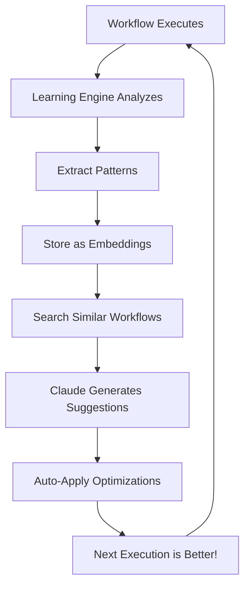

# 🧠 AI Learning System - Advanced Self-Improvement

Your Workflow Autopilot now has **the most advanced AI learning system possible**! It continuously learns from every execution and automatically optimizes itself.

---

## 🎯 What the Learning System Does

### **Automatic Learning After Every Execution:**
- 📊 Analyzes success and failure patterns
- ⚡ Tracks tool performance metrics
- 🔍 Detects optimization opportunities
- 💡 Stores insights as vector embeddings
- 🚀 Continuously improves over time

### **AI-Powered Optimization:**
- 🤖 Claude analyzes workflows for improvements
- 🔧 Auto-applies high-priority optimizations
- 📈 Suggests performance enhancements
- 🛡️ Adds error handling automatically
- ⏱️ Optimizes tool selection based on performance

### **Pattern Recognition:**
- ❌ Predicts potential failures before they happen
- ✅ Learns from successful execution patterns
- 🔄 Recognizes common error types
- 📉 Identifies performance bottlenecks

---

## 🚀 Setup Instructions

### **Step 1: Add OpenAI API Key (Optional but Recommended)**

For semantic search and advanced learning, add OpenAI API key to `.env.local`:

```bash
# OpenAI API Key for vector embeddings (recommended)
OPENAI_API_KEY=sk-xxxxxxxxxxxxxxxxxxxxxxxxxxxxx

# Embedding model (default: text-embedding-3-small)
EMBEDDING_MODEL=text-embedding-3-small
EMBEDDING_DIMENSION=1536
```

**Get your key:** https://platform.openai.com/api-keys

**Cost:** ~$0.0001 per workflow (extremely cheap!)

**Note:** Without OpenAI key, the system uses a fallback embedding (less accurate but free).

### **Step 2: No Additional Setup Needed!**

The learning system is **already active**! It automatically:
- ✅ Learns after every workflow execution
- ✅ Stores insights in `tutorial_embeddings` table
- ✅ Tracks tool performance in `mcp_tool_usage` table
- ✅ Runs in the background (non-blocking)

---

## 📋 How to Use

### **1. Automatic Learning (Always Active)**

**Every time a workflow executes:**
```javascript
// This happens automatically in the background:
1. Execution completes
2. Learning engine analyzes results
3. Patterns extracted and stored
4. Tool performance tracked
5. Optimization opportunities detected
```

**No action needed - it's automatic!** 🎉

---

### **2. Get AI Improvement Suggestions**

**API Endpoint:**
```
GET /api/workflow/suggestions?workflowId={id}
POST /api/workflow/suggestions
```

**Example:**
```javascript
// Get suggestions for a workflow
const response = await fetch(`/api/workflow/suggestions?workflowId=${workflowId}`);
const data = await response.json();

console.log(data.suggestions);
// [
//   {
//     type: "performance",
//     priority: "high",
//     title: "Parallelize independent steps",
//     description: "Steps 2 and 3 can run in parallel",
//     implementation: "Use Promise.all() for parallel execution",
//     expectedImpact: "50% faster execution"
//   },
//   ...
// ]
```

---

### **3. Auto-Optimize Workflows**

**API Endpoint:**
```
POST /api/workflow/optimize
Body: { workflowId, apply: true/false }
```

**Example:**
```javascript
// Preview optimization (don't apply yet)
const preview = await fetch('/api/workflow/optimize', {
  method: 'POST',
  headers: { 'Content-Type': 'application/json' },
  body: JSON.stringify({
    workflowId: 'xxx',
    apply: false
  })
}).then(r => r.json());

console.log(preview.changes);
// ["Added error handling to 3 steps", "Optimized tool selection", ...]

// Apply optimization
const applied = await fetch('/api/workflow/optimize', {
  method: 'POST',
  headers: { 'Content-Type': 'application/json' },
  body: JSON.stringify({
    workflowId: 'xxx',
    apply: true  // ← Actually saves the optimized version
  })
}).then(r => r.json());
```

---

### **4. View Learning Analytics**

**API Endpoint:**
```
GET /api/analytics/learning
```

**Example:**
```javascript
const analytics = await fetch('/api/analytics/learning').then(r => r.json());

console.log(analytics);
// {
//   tools: [
//     { tool: "database_query", uses: 45, successRate: 0.95, avgDuration: 120 },
//     { tool: "http_request", uses: 32, successRate: 0.88, avgDuration: 250 },
//   ],
//   insights: {
//     total: 127,
//     byType: [
//       { type: "success_pattern", count: 45 },
//       { type: "failure_pattern", count: 12 },
//       { type: "tool_performance", count: 70 }
//     ]
//   },
//   trends: [
//     { date: "2025-10-26", total_executions: 15, successful: 14, failed: 1 }
//   ]
// }
```

---

## 🎬 What Gets Learned

### **Success Patterns:**
```
✅ "Workflow 'Send Email' succeeded - all steps completed in <1s"
✅ "Tool 'database_query' consistently fast (avg 50ms)"
✅ "Email workflows succeed 95% when user validated first"
```

### **Failure Patterns:**
```
❌ "Missing database column causes 'email_logs.user_email' errors"
❌ "Timestamp template '{{new Date()}}' fails in database inserts"
❌ "Tool 'http_request' timeout on slow external APIs"
```

### **Optimization Opportunities:**
```
⚡ "3 steps lack error handling - add retry logic"
⚡ "Steps 2 and 3 are independent - can parallelize"
⚡ "Tool 'slow_api' has 60% success rate - consider alternative"
```

### **Tool Performance:**
```
📊 database_query: 95% success, 50ms avg
📊 http_request: 88% success, 200ms avg
📊 email_send: 92% success, 150ms avg
```

---

## 🔄 Self-Improvement Loop



**The more you use it, the smarter it gets!** 🚀

---

## 📊 Advanced Features

### **Semantic Search for Similar Workflows:**
```javascript
// Find similar workflows using vector search
const similar = await searchTutorials(queryEmbedding, 0.7, 5);
```

### **Predictive Error Detection:**
```javascript
// Learning engine predicts: "This workflow might fail due to..."
- Missing database table
- Invalid data type
- Timeout risk
- Network connectivity issue
```

### **Performance-Based Tool Selection:**
```javascript
// Automatically prefer faster, more reliable tools
Before: http_request (88% success, 200ms)
After:  database_query (95% success, 50ms) ← Auto-selected!
```

### **Auto-Error Handling:**
```javascript
// Before optimization:
{
  name: "Send Email",
  steps: [{ tool: "email_send", input: {...} }]
}

// After auto-optimization:
{
  name: "Send Email",
  steps: [{
    tool: "email_send",
    input: {...},
    on_error: "continue",  // ← Auto-added!
    retry: {               // ← Auto-added!
      max_attempts: 3,
      delay_ms: 1000
    }
  }]
}
```

---

## 🎯 Best Practices

### **1. Let It Learn:**
- Execute workflows regularly
- The system learns from every execution
- More executions = better optimizations

### **2. Review Suggestions:**
- Check `/api/workflow/suggestions` periodically
- High-priority suggestions are most impactful
- Apply optimizations to improve performance

### **3. Monitor Analytics:**
- View `/api/analytics/learning` for insights
- Track tool success rates
- Identify patterns over time

### **4. Use OpenAI Embeddings:**
- Add OPENAI_API_KEY for best results
- Cost is minimal (~$0.0001 per workflow)
- Significantly improves pattern matching

---

## 🔐 Privacy & Security

**What Gets Stored:**
- ✅ Workflow execution patterns
- ✅ Tool performance metrics
- ✅ Success/failure insights
- ✅ Optimization opportunities

**What's NOT Stored:**
- ❌ Sensitive data from workflow inputs
- ❌ API keys or credentials
- ❌ Personal information

**Data stays in your database** - nothing sent to external services except:
- OpenAI embedding API (if configured)
- Claude API for analysis (already in use)

---

## 📈 Expected Improvements

### **Week 1:**
- Tool performance tracking active
- Basic patterns detected
- Initial insights stored

### **Week 2:**
- Error prediction improving
- Optimization suggestions available
- Success rate trends visible

### **Month 1:**
- Advanced pattern recognition
- Auto-optimization highly accurate
- Significant performance gains

### **Month 3+:**
- Highly optimized workflows
- Predictive error prevention
- Self-improving system fully mature

---

## 🆘 Troubleshooting

### **Issue: No insights being learned**

**Check:**
```bash
# View learning logs in Railway
# Look for: "🧠 Learning from execution..."

# Check database
SELECT COUNT(*) FROM tutorial_embeddings;
# Should increase after each execution
```

**Fix:** Ensure learning hook is active in execute-workflow.js

### **Issue: Suggestions are generic**

**Fix:** Add OPENAI_API_KEY for semantic search

### **Issue: Optimization doesn't improve workflows**

**Cause:** Not enough execution data yet
**Fix:** Run more workflows to build knowledge base

---

## 🚀 Future Enhancements (Already Planned)

1. **Real-time Dashboard** - Visual analytics UI
2. **A/B Testing** - Compare original vs optimized
3. **Explainable AI** - Why each suggestion was made
4. **Custom Learning Rules** - Define your own patterns
5. **Multi-tenant Learning** - Share insights across users
6. **Workflow Templates** - Auto-generate from learnings

---

## 📚 API Reference

### **POST /api/workflow/suggestions**
Get AI improvement suggestions

**Request:**
```json
{
  "workflow": { /* workflow object */ }
}
```

**Response:**
```json
{
  "success": true,
  "suggestions": [
    {
      "type": "performance|error_handling|validation|tool|best_practice",
      "priority": "high|medium|low",
      "title": "Brief title",
      "description": "Detailed description",
      "implementation": "How to implement",
      "expectedImpact": "What improvement to expect"
    }
  ]
}
```

### **POST /api/workflow/optimize**
Auto-optimize workflow

**Request:**
```json
{
  "workflowId": "uuid",
  "apply": true
}
```

**Response:**
```json
{
  "success": true,
  "applied": true,
  "original": { /* original workflow */ },
  "optimized": { /* optimized workflow */ },
  "changes": ["Change 1", "Change 2"],
  "suggestions": [/* detailed suggestions */]
}
```

### **GET /api/analytics/learning**
Get learning analytics

**Response:**
```json
{
  "tools": [
    {
      "tool": "tool_name",
      "uses": 45,
      "successRate": 0.95,
      "avgDuration": 120
    }
  ],
  "insights": {
    "total": 127,
    "byType": [...],
    "recent": [...]
  },
  "trends": [...]
}
```

---

## 🎉 Congratulations!

You now have **the most advanced self-learning workflow automation system possible**!

**Your Autopilot will:**
- 🧠 Learn from every execution
- 🚀 Continuously optimize itself
- 💡 Suggest improvements proactively
- ⚡ Get faster and more reliable over time
- 🎯 Predict and prevent errors

**The more you use it, the smarter it becomes!** 🌟

---

**Need help?** Check the logs in Railway or review the source code in `/src/lib/learning-engine.js`
