# 🚂 Migrate to Railway in 5 Minutes

## TL;DR: It's Super Easy!

Your code is **already compatible** with Railway! No code changes needed.

---

## ⏱️ 5-Minute Migration Steps

### Step 1: Create Railway Project (1 minute)

1. Go to [railway.app](https://railway.app)
2. Click **"Login"** → Sign in with GitHub
3. Click **"New Project"**
4. Select **"Deploy from GitHub repo"**
5. Choose **`VidDazzleLLC/viddazzle`**
6. Railway detects Next.js automatically ✅

**That's it!** Railway starts deploying your app.

---

### Step 2: Add PostgreSQL Database (30 seconds)

1. In your Railway project, click **"New"**
2. Select **"Database"**
3. Click **"Add PostgreSQL"**
4. Done! Railway auto-configures connection.

Railway automatically adds these environment variables:
- `DATABASE_URL`
- `POSTGRES_URL`
- `PGHOST`, `PGPORT`, `PGUSER`, `PGPASSWORD`, `PGDATABASE`

---

### Step 3: Enable pgvector (30 seconds)

1. Click on your **PostgreSQL** service
2. Go to **"Query"** tab
3. Run this command:

```sql
CREATE EXTENSION IF NOT EXISTS vector;
```

---

### Step 4: Run Database Schema (1 minute)

Still in the PostgreSQL Query tab:

1. Copy the entire content from `supabase/schema.sql`
2. Paste it into the query box
3. Click **"Run"** (or press Ctrl+Enter)

This creates all your tables, indexes, and functions.

---

### Step 5: Add Environment Variables (2 minutes)

1. Click on your **App service** (not the database)
2. Go to **"Variables"** tab
3. Click **"New Variable"** for each:

```bash
# Required
ANTHROPIC_API_KEY=sk-ant-api03-xxxxx  # Your Claude API key
CLAUDE_MODEL=claude-opus-4-20250514

# Optional but recommended
OPENAI_API_KEY=sk-xxxxx  # For embeddings (optional)
MCP_TOOLS_ENABLED=true
MAX_WORKFLOW_STEPS=50
WORKFLOW_TIMEOUT=300000
NODE_ENV=production
```

**Note**: `DATABASE_URL` is already auto-set by Railway!

---

### Step 6: Deploy! (Auto)

Railway automatically redeploys when you add environment variables.

Or manually trigger: **"Deploy"** → **"Redeploy"**

---

## ✅ That's It!

Your app is now live at: `https://your-app-name.up.railway.app`

Total time: **~5 minutes**

---

## 🔍 Why It's So Easy

### Your Code Is Already Ready!

1. ✅ **Database adapter auto-detects**
   - `src/lib/db.js` checks for `DATABASE_URL`
   - Automatically uses PostgreSQL client
   - Zero code changes needed!

2. ✅ **Dependencies installed**
   - `pg` package already in `package.json`
   - Railway runs `npm install` automatically

3. ✅ **Schema is ready**
   - Just copy/paste `supabase/schema.sql`
   - Same schema works everywhere

---

## 📊 Before vs After

### Before (Supabase)
```javascript
// Uses Supabase client
import { createWorkflow } from '@/lib/db';
// Auto-detects NEXT_PUBLIC_SUPABASE_URL
```

### After (Railway)
```javascript
// Uses PostgreSQL client
import { createWorkflow } from '@/lib/db';
// Auto-detects DATABASE_URL
```

**Same import!** The adapter handles everything.

---

## 🎯 What Changes?

### Environment Variables

**Remove these** (Supabase-specific):
```bash
NEXT_PUBLIC_SUPABASE_URL=...
NEXT_PUBLIC_SUPABASE_ANON_KEY=...
SUPABASE_SERVICE_ROLE_KEY=...
```

**Auto-added by Railway**:
```bash
DATABASE_URL=postgresql://...  # Railway PostgreSQL
POSTGRES_URL=postgresql://...  # Alternative format
```

**You add these** (same as before):
```bash
ANTHROPIC_API_KEY=sk-ant-api03-xxxxx
CLAUDE_MODEL=claude-opus-4-20250514
```

---

## 💰 Cost Comparison

### Current (Supabase)
- **Free**: 500MB database, 50,000 monthly active users
- **Paid**: $25/month for Pro

### Railway
- **Free**: $5 free credits/month (~500 compute hours)
- **Paid**: $5/month subscription + $0.000463/min
- **Typical**: ~$15-25/month for active apps

### For This App (Estimated)
- **Low traffic**: Railway free tier covers it ($0)
- **Medium traffic**: ~$10-15/month on Railway
- **High traffic**: ~$20-30/month on Railway

---

## 🚀 Deploy Workflow

```mermaid
graph LR
    A[Create Railway Project] --> B[Add PostgreSQL]
    B --> C[Enable pgvector]
    C --> D[Run Schema]
    D --> E[Add Env Vars]
    E --> F[Auto Deploy]
    F --> G[Live! 🎉]
```



---

## 🔧 Troubleshooting

### Build Fails
**Issue**: Missing dependencies
**Fix**: Railway auto-installs from package.json (already done ✅)

### Database Connection Error
**Issue**: pgvector not enabled
**Fix**: Run `CREATE EXTENSION vector;` in Query tab

### API Errors
**Issue**: Missing ANTHROPIC_API_KEY
**Fix**: Add in Railway Variables tab

---

## 📱 Managing Your App

### View Logs
```bash
# In Railway dashboard
Click your app → "Logs" tab

# Or use CLI
railway logs
```

### Redeploy
```bash
# Automatic: Push to GitHub
git push origin main

# Manual: In Railway dashboard
"Deploy" → "Redeploy"
```

### Scale
```bash
# In Railway dashboard
Click app → "Settings" → "Autoscaling"
```

---

## 🎁 Bonus Features

Railway gives you:

1. **Auto HTTPS** - Free SSL certificates
2. **Auto deploys** - Every git push = new deployment
3. **Environment previews** - Test branches before merging
4. **Metrics** - CPU, memory, network usage
5. **Webhooks** - Deploy notifications
6. **Custom domains** - Add your own domain

---

## ⚡ Quick Command Reference

```bash
# Install Railway CLI (optional)
npm install -g @railway/cli

# Login
railway login

# Link to your project
railway link

# View logs
railway logs

# Open app in browser
railway open

# Run locally with Railway env vars
railway run npm run dev
```

---

## 🎊 Summary

Moving to Railway is **ridiculously easy** because:

1. ✅ Your code is already compatible
2. ✅ No code changes needed
3. ✅ Just deploy from GitHub
4. ✅ Railway auto-configures database
5. ✅ Same environment variables pattern

**Time to deploy**: 5 minutes
**Difficulty**: ⭐ (Very Easy)
**Recommendation**: ⭐⭐⭐⭐⭐ (Highly recommended!)

---

## 🚀 Ready to Deploy?

1. **Now**: Go to [railway.app](https://railway.app)
2. **Click**: "New Project" → "Deploy from GitHub"
3. **Select**: `VidDazzleLLC/viddazzle`
4. **Wait**: 2 minutes for build
5. **Add**: PostgreSQL database
6. **Run**: Schema from `supabase/schema.sql`
7. **Add**: Environment variables
8. **Done**: Your app is live! 🎉

---

**Questions?** Railway has great docs at [docs.railway.app](https://docs.railway.app)

Let's deploy! 🚂💨
